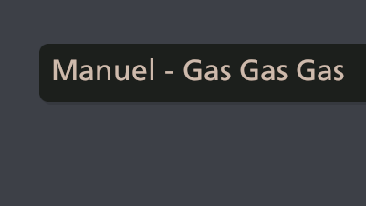
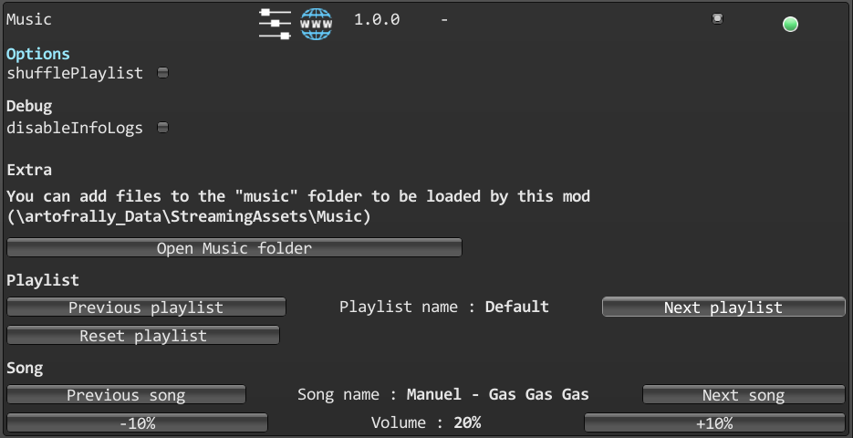

# Music

[](https://github.com/MMike17/ArtOfRally_Music/releases/latest)


A mod for Art of Rally that lets you add custom music to the game.

#### Launcher Support


#### Platform Support


## Usage

Press Ctrl + F10 to open the mod manager menu.\
Adjust settings to select the playlist you want to play during a race.\
By default, the mod does not change the race playlist.

- **shufflePlaylist** : will activate random song order.
- **disableInfoLog** : will disable log messages sent by the mod.

- **Open Music Folder** : will open an explorer window on the folder where you need to place the files (only on windows).

- **Previous playlist** : will select the previous playlist.
- **Playlist name** : displays the name of the currently selected playlist.
- **Next playlist** : will select the next playlist.
- **Reset playlist** : will play the original playlist (without changing the selection).

- **Previous song** : will select the previous song in the playlist.
- **Song name** : displays the name of the current song.
- **Next song** : will select the next song in the playlist.

- **-10%** : will decrease the current song's volume by 10%.
- **Volume** : displays the volume of the current song.
- **+10%** : will increase the current song's volume by 10%.

Disabling the mod in the manager will reinstate the default playlist on races.

## Disclaimer

This mod **will** freeze the game on startup while its loading the sound files.

## Installation

Follow the [installation guide](https://www.nexusmods.com/site/mods/21/) of
the Unity Mod Manager.\
Then simply download the [latest release](https://github.com/MMike17/ArtOfRally_Music/releases/latest)
and drop it into the mod manager's mods page.

## Showcase




## Mod support

You can add your own songs and your own playlists through this mod.\
For this you will have to create your own mod.\
I suggest using the [ModBase](https://github.com/MMike17/ArtOfRally_ModBase) repo as a template.

There are 2 ways to add music files through this mod :

1. Build an asset bundle containing all your audio files using Unity 2019.4.38
2. Ship your music files with your mod files

You can then add your own playlist through the `MusicProvider` class.\
The `MusicProvider` can inject your songs and playlists through the `Playlist` class.\
Inject your playlist through the `AddPlaylist` method :

``` csharp
using Music;

[...]

// To load songs from a local file
Playlist myPlaylist = new Playlist("My playlist name");
myPlaylist.AddMusicFromFile("my\file\absolute\path");

// To load songs from your AssetBundle
AudioClip[] clips; // load from AssetBundle here
Playlist myPlaylist = new Playlist("My playlist name", clips);

[...]

MusicProvider.AddPlaylist(myPlaylist);
```

The `MusicProvider` also exposes 4 other methods to help you control which playlist is playing :

- `SelectPreviousPlaylist` : will select the previous playlist.
- `SelectNextPlaylist` : will select the next playlist.
- `StartCustomPlaylist` : will play the currently selected playlist.
- `ResetPlaylist` : will play the game's original playlist.

**/!\\** The playlist's name has to be unique. **/!\\**\
**/!\\** The playlist name "**Racing**" is already used by the game. **/!\\**