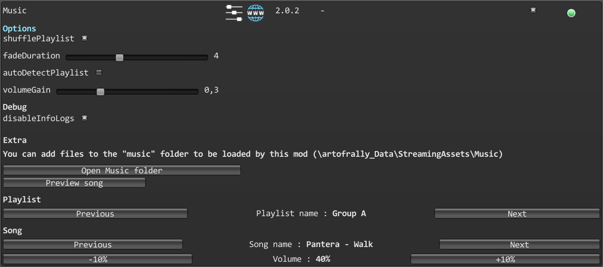

# Music

A mod for Art of Rally that lets you add custom music to the game.

#### Launcher Support

#### Platform Support

## Usage

Press Ctrl + F10 to open the mod manager menu.\
Adjust settings to select the playlist you want to play during a race.\
By default, the mod plays a default playlist which is empty by default.

### General

- **shufflePlaylist** : will shuffle the songs of a playlist randomly.
- **fadeDuration** : duration of the fading of a song's volume.
- **rotatePlaylist** : rotates between playlists if shufflePlaylist is disabled.
- **autoDetectPlaylist** : automatically selects a playlist carying the same name as the group of the car (Group 2, Group B, etc...)
- **volumeGain** : adds gain to custom music before applying multipliers, this will balance volume between menu music and custom music.

### Debug

- **disableInfoLog** : will disable log messages sent by the mod.

### Extra

- **Open Music Folder** : will open an explorer window on the folder where you need to place the files (only on windows).
- **Preview song** / **Stop preview** : preview of the currently selected song, this is disabled during a rally.

### Playlist

- **Previous** : selects the previous playlist.
- **Playlist name** : name of the currently selected playlist.
- **Next** : selects the next playlist.

### Song

- **Previous** : selects the previous song in the playlist.
- **Song name** : name of the currently selected song.
- **Next** : selects the next song in the playlist.
- **-10%** : will decrease the current song's volume by 10%.
- **Volume** : displays the volume of the current song.
- **+10%** : will increase the current song's volume by 10%.

The playlist and song controlls will work during a race outside of preview mode.\
Disabling the mod in the manager will reinstate the default playlist on races.

## Recommandations

Here are recommanded playlists for the **autoDetectPlaylist** feature.

**Group 2**
- Black Sabath - Iron Man
- Black Sabbath - Paranoid
- Deep Purple - Fireball
- Deep Purple - Highway Star
- Jimi Hendrix - Purple Haze
- Led Zeplin - Immigrant Song
- Led Zeppelin - Black Dog
- Led Zeppelin - Rock and Roll
- Led Zeppelin - Whole Lotta Love
- MC5 - Kick Out the Jams
- New York Dolls - Bad Girl
- Steppenwolf - Born To Be Wild
- T. Rex - Bang a Gong
- The Doors - Break on Through
- The Kinks - You Really Got Me

**Group 3**
- AC_DC - High Voltage
- AC_DC - T.N.T.
- Aerosmith - Walk This Way
- Alice Cooper - School's Out
- Deep Purple - Smoke On The Water
- KISS - Rock And Roll All Nite
- Queen - Keep Yourself Alive
- Queen - Stone Cold Crazy
- Uriah Heep - Easy Livin

**Group 4**
- AC_DC - Highway to Hell
- ELO - Don't Bring Me Down
- The Clash - London Calling
- Thin Lizzy - Bad Reputation

**Group B**
- Back In Black - AC_DC
- Blackout - Scorpions
- Call me - Blondie
- Eye Of The Tiger - Survivor
- I Love Rock 'n' Roll - Joan Jett
- Jump - Van Halen
- Kickstart My Heart - Mötley Crüe
- Master of Puppets - Metallica
- The Final Countdown - Europe

**Group S**
- Slayer - South of Heaven
- Savatage - Hall Of The Mountain King
- Ratt - Round and Round
- Motley Crue - Wild Side
- Megadeath - Holy Wars... The Punishment Due
- Living Colour - Cult of Personality
- Guns and Roses - Welcome To The Jungle
- Guns and Roses - Sweet Child O Mine

**Group A**
- Corrosion of Conformity - Dance Of The Dead
- Deftones - My Own Summer
- Pantera - Walk
- Rage against the Machine - Bulls On Parade
- Sepultura - Roots Bloody Roots

## Disclaimer

This mod **might** freeze the game on startup while its loading the sound files.\
This mod overrides the base game's playlist system, transitions between the two might not be smooth.

## Installation

Follow the [installation guide](https://www.nexusmods.com/site/mods/21/) of
the Unity Mod Manager.\
Then simply download the [latest release](https://github.com/MMike17/ArtOfRally_Music/releases/latest)
and drop it into the mod manager's mods page.

## Showcase

